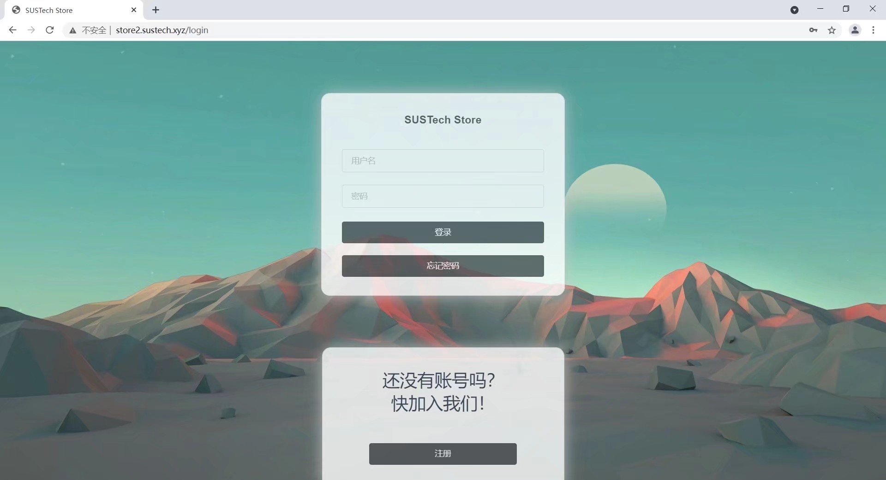
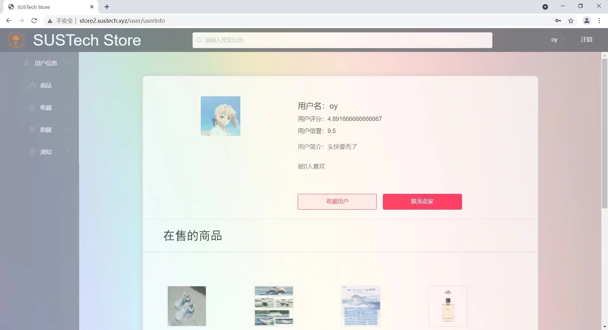
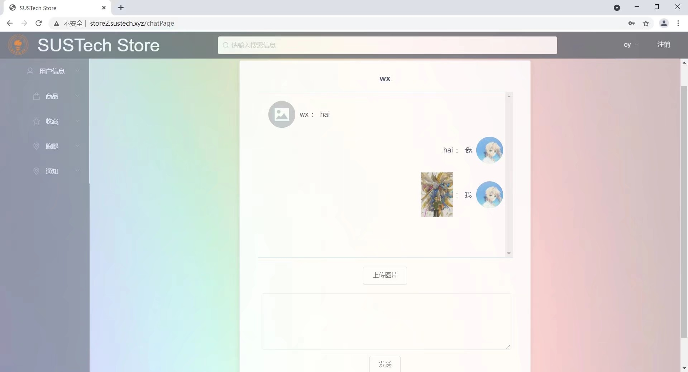

## SUSTech Store(电商+跑腿系统)

- 技术栈：Vue.js + elementUI + Django + PostgreSQL + Docker + WebSocket + Vuex
- 前后端分离，主要功能点有注册、登录、修改密码、找回密码、发邮件、上传/购买商品、查看订单、发放/接受跑腿任务、实时聊天、中文分词搜索

项目截图：
登录页面

用户信息展示页面

聊天页面

